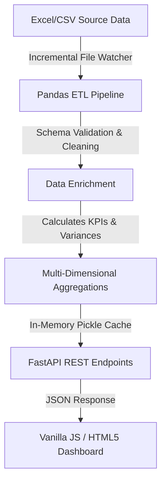

# Web-Based Production BI Dashboard

An interactive, self-hosted Business Intelligence (BI) dashboard integrated into the manufacturing execution environment. This project mirrors core components of Keyence Analytics (KI) and Power BI setups, bringing data visibility directly to all factory operators and management without additional software licensing costs.

---

## 🏗️ Architecture & Data Pipeline (ETL)

The backend is built with **FastAPI** serving a high-performance **Pandas-based ETL pipeline**. 



### 1. Ingestion & Caching
- **Source Verification:** Monitors modification times of source Excel sheets (`生産実績_全社.xlsx`, `生産実績_目標1.xlsx`, etc.) to trigger incremental processing.
- **Cache Layer:** Serializes intermediate states into serialized binary files (`.pkl`) to avoid repeating heavy parsing operations, reducing page load latency from seconds to milliseconds.

### 2. Data Enrichment & Cleansing
- **Input Validation:** Normalizes and parses dates, machine names, and customer keys.
- **Target Flagging:** Classifies machines dynamically into "target machines" or "processing units" based on rule mappings.
- **Derived Metrics:** Calculates finishing lengths, set-up frequencies, and hourly yield metrics.

### 3. Multi-Dimensional Data Aggregation (Logical Tables)
The ETL pipeline prepares multi-dimensional views designed for manufacturing analysis:
- **Customer/Machine Performance Table (`customer_machine_perf`):** Aggregates yield, finish meters, target setups, and group productivity. Computes expected vs. actual work hours (gap analysis).
- **Factory/Target Performance Table (`factory_target_perf`):** Aggregates metrics at the factory and production line hierarchy level.
- **Variance Analysis View (`target_variance_analysis` / `category_variance_analysis`):** Combines raw aggregates to decompose production gaps into:
  - **Efficiency Variance (能率差異):** Impact of line-level performance improvements/declines.
  - **Mix Variance (構成差異):** Impact of shifting order volume between different machines.

---

## 📈 Key Production Metrics

The dashboard visualizes and tracks:
- **Productivity (生産性):** Output length (meters) per hour.
- **LSP (ラインスピード):** Speed of production runs.
- **Operating Rate (稼働率):** Run time vs. total hours.
- **Setup Time (段取時間):** Average duration for machinery reconfiguration.

---

## 🚀 How to Run Locally

### 1. Install Dependencies
Ensure you have Python 3.10+ installed. Install the minimal dependencies:
```bash
pip install -r requirements.txt
```

### 2. Run the Server
Start the FastAPI server:
```bash
uvicorn app.main:app --reload
```

### 3. Access the Dashboard
Open your browser and navigate to:
[http://127.0.0.1:8000/dashboard](http://127.0.0.1:8000/dashboard) or the root URL [http://127.0.0.1:8000/](http://127.0.0.1:8000/).
